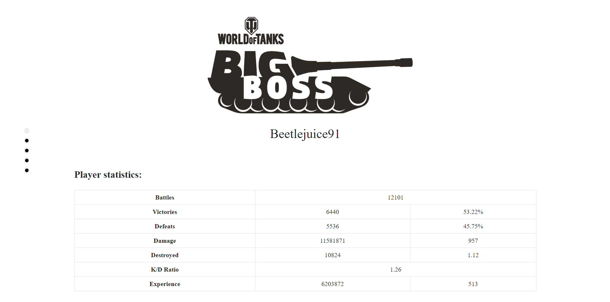
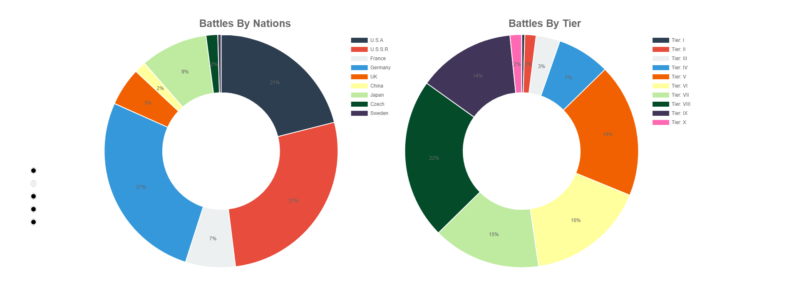
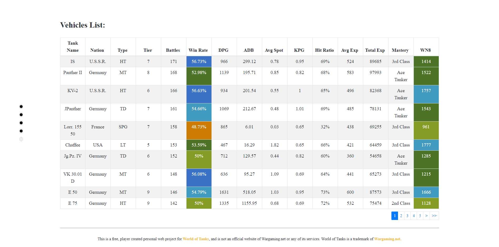

# World of Tanks Statistics Site

## Description
This is my personal project for statistics from World of Tanks games.I built it using html,css and javascript.In this case i used Nodejs with Express to create server and RESTful API, connected to MongoDB database via mLab.On Front end ReactJs javascript framework and Redux as state menager with Redux DevTools for menagment, also axios client for promise requests.Some of API used is from Wargaming.net and some of data is synchronous and collected with webscraping using Octoparse as tool and it was exported in JSON format.For displaying all data i used Chart.js for building charts and graphics and Reactstrap for building dynamic tables and data calculations.
## Installation
A step by step of examples  

*If you are using node package manager (npm) first step will be  

`npm install` 

*If you are using Yarn first step will be  

`yarn install` 

`npm start` 

to start live server and preview of app   

*Or for yarn users  

`yarn run start` 

## Usage

* Wait for Loading screen animation and click button to start  
  
* First tou will see starting point with async table of my calculated stats  
  
*Also some of animated charts to look on 
  
And dynamic tables with sorting functions to play with   
  

## Built With

- Node.js - JavaScript run-time environment  
- Express - Node.js framework 
- React.js - Javascript framework 
- MongoDB - NoSQL database program 
- mLab - Cloud MongoDB service 
- Developers.wargaming.net - API 
- Redux - Open-source JavaScript library for managing application state 
- Redux DevTools - Extension for debugging application's state changes 
- Chart.js -  HTML5 based JavaScript charts library 
- Axios - HTTP client  
- Octoparse - Web Scraping Tool  
- Visual Studio Code - Source code editor 

## Author

- **Nikola Stanisavljevic**   :+1:
